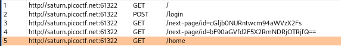
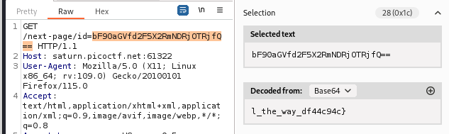
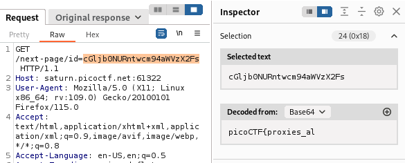

---


Once the website opens, enter the credentials `test:test!` while having Burp Suite Proxy HTTP History tab open.
- Notice how there are multiple requests sent, and quickly, we are placed at the `/home` page.



> I glimpsed an equal sign at the end of request number 4, hinting at the possibility of base64 encoding.

So i opened request 4, and selected the text after the `id=` query parameter, and to my luck, part of the flag was exposed.



So I then opened the request before it and decoded the value of the `id` query parameter, and got the first part of the flag:



Combining both parts, we get the flag:

```text
picoCTF{proxies_all_the_way_df44c94c}
```

---
