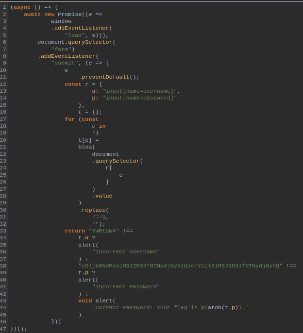
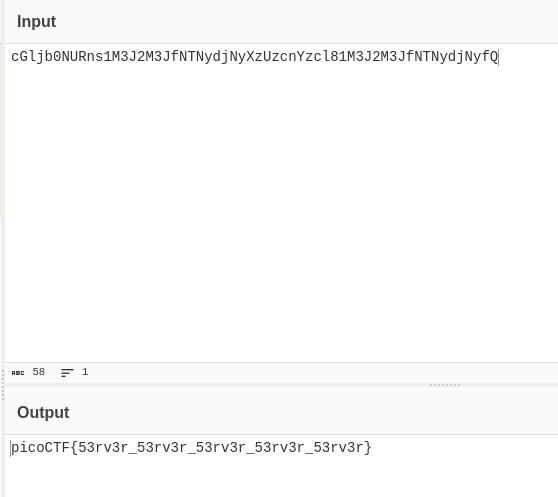

---

Opening the link and then heading to the Network tab in the developer tools in the browser, we see there is an `index.js` file.



We see that near the bottom, it is comparing a value with the username, and another value with the password.
- Copying the 2 values to [cyberchef](https://gchq.github.io/CyberChef/) to see if it can decode them into anything.



> The value that is compared with the password can be decoded from base64, and it produces the flag.

```text
picoCTF{53rv3r_53rv3r_53rv3r_53rv3r_53rv3r}
```

---
