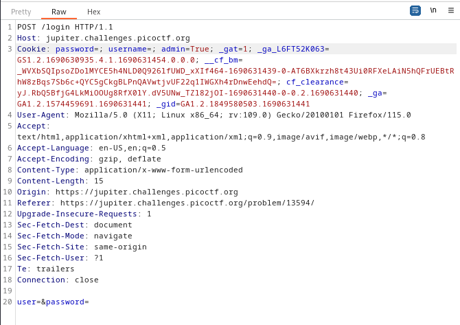
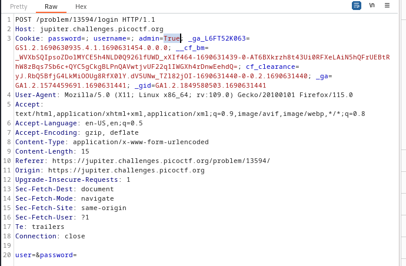
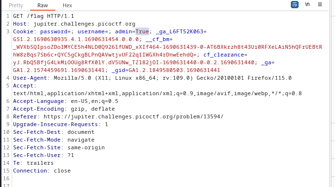
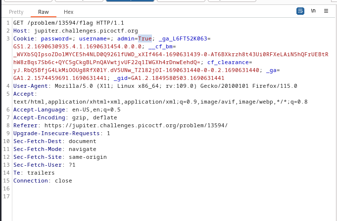
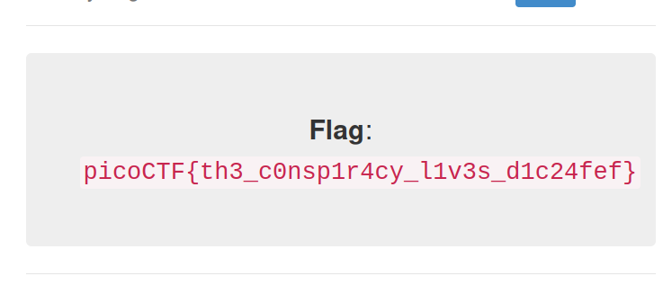

----

> With BURPSUITE PROXY INTERCEPT on, sign in with no credentials.

> Intercept the login request, and see that there is a cookie called `admin`.
> Set it to True.



> Forward this request.
> See another `POST` request to `/problem/13594/login`, with an `admin` cookie set to False. Change it to True and forward.




> We get another few requests with the same `admin` cookie set to false. Set all to True and keep forwarding.





> Finally we get the flag.



```
flag: picoCTF{th3_c0nsp1r4cy_l1v3s_d1c24fef}
```

---
