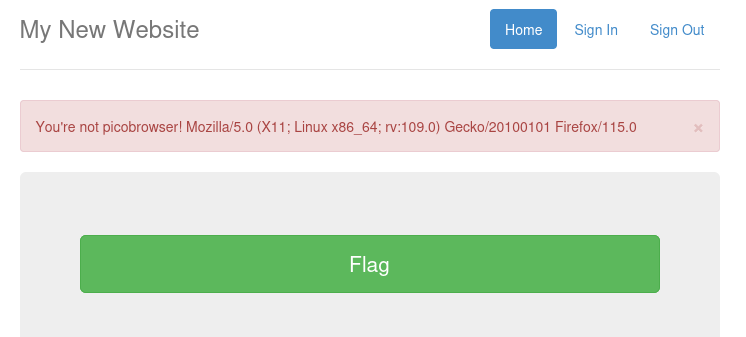
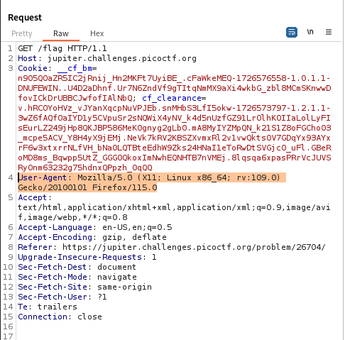
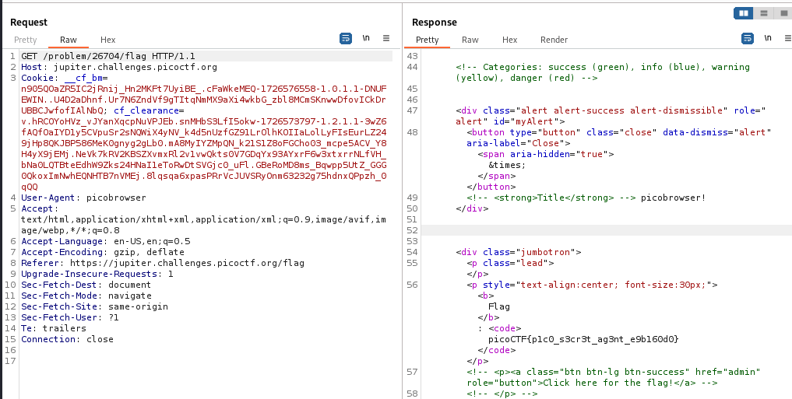

---

Opening the website link, we see there is a green button with the text 'flag'.
- Clicking on it states that we are not `picobrowser`.



Opening this request in Burp Suite Proxy's HTTP History tab, we see the request being sent, and the data that is output in the picture above is actually the value of the `User-Agent` header.



Sending this request to repeater, and changing the value of the `User-Agent` header to `picobrowser`.

> Follow the redirection.



We see the flag is output.

```text
picoCTF{p1c0_s3cr3t_ag3nt_e9b160d0}
```

---
