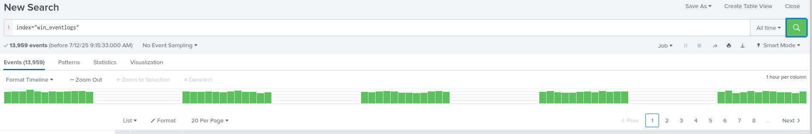
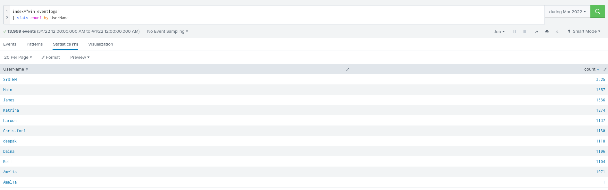
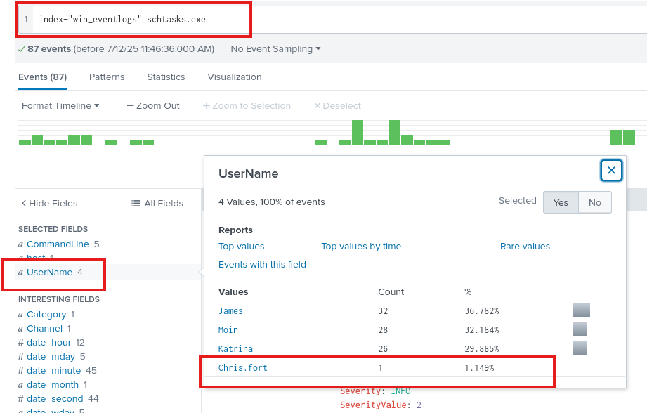
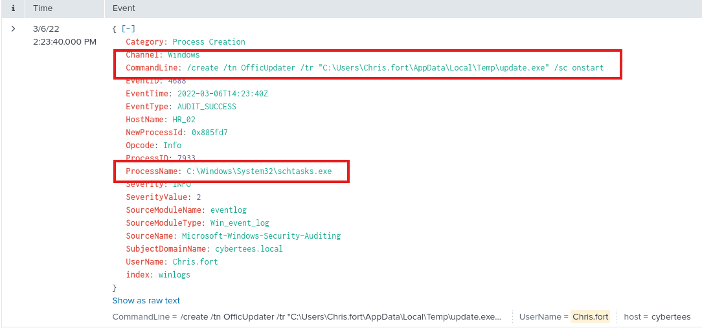
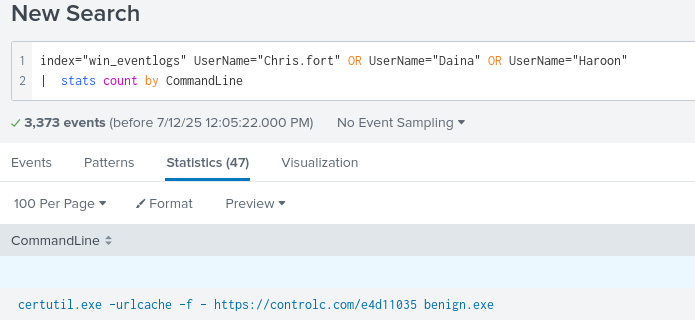
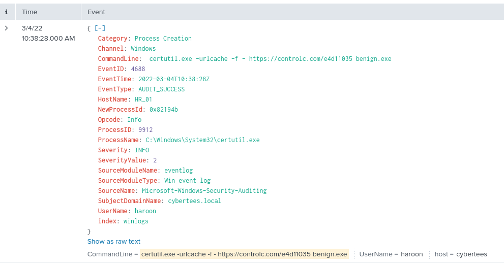
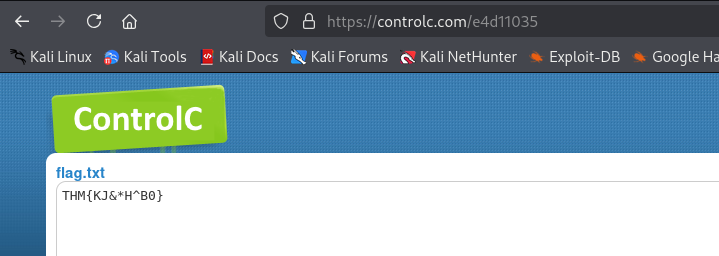

---

Opening the Splunk searching interface and searching for the given index `win_eventlogs` and choosing `All time` from the time selector, we get the following output:



We see there are `13959` events and hovering over the green columns they all take place between Friday March 4 to Tuesday March 8 in 2022.

###### How many logs are ingested from the month of March, 2022? : `13959`

Next, to find the weird username, we need to display all the usernames that are present in the logs using this query:
```
index="win_eventlogs"
| stats count by UserName
```



We see that all of the usernames make sense as presented in the question except the last username that was present only once in the logs : `Amel1a`.

###### Imposter Alert: There seems to be an imposter account observed in the logs, what is the name of that user? : `Amel1a`

Now, we are looking for scheduled tasks.
- I don't know how that looks like in windows, so I do a quick google search.
- Scheduled tasks can be achieved using the `schtasks.exe` executable.

So, modifying my query to look for this executable:
```
index="win_eventlogs" schtasks
```

We see around 87 events, so we filter by the `UserName` field and we see there are 4 usernames, only one of them being in the HR department.



If we open that event by clicking on the user `Chris.fort`, we can see the exact `CommandLine` field value that was used.



###### Which user from the HR department was observed to be running scheduled tasks? : `Chris.fort`

To figure out which user from the HR department used a binary from [lolbas](https://lolbas-project.github.io/#), I wrote this query to display all the `CommandLine` values for all of the HR users:
```
index="win_eventlogs" UserName="Chris.fort" OR UserName="Daina" OR UserName="Haroon"
|  stats count by CommandLine
```

All of the results look normal except one that stands out that uses `certutil.exe`, as I had taken some time to look through the [lolbas](https://lolbas-project.github.io/#) and I remembered this name.



Clicking on this event, we can see more details about it and can see the user that initiated this command.



We see that it uses the `certutil.exe` process and it downloads a file called `benign.exe`.
- The username is `haroon`.
- The date is `2022-03-04`
- The website it downloads it from is `controlc.com`

###### Which user from the HR department executed a system process (LOLBIN) to download a payload from a file-sharing host. : `haroon`

###### To bypass the security controls, which system process (lolbin) was used to download a payload from the internet? : `certutil.exe`

###### What was the date that this binary was executed by the infected host? format (YYYY-MM-DD) : `2022-03-04`

###### Which third-party site was accessed to download the malicious payload? : `controlc.com`

###### What is the name of the file that was saved on the host machine from the C2 server during the post-exploitation phase? : `benign.exe`

Opening up the link `https://controlc.com/e4d11035` that was used to download the file, we see the flag.txt file containing the flag.



###### The suspicious file downloaded from the C2 server contained malicious content with the pattern THM{..........}; what is that pattern? : `THM{KJ&*H^B0}`

###### What is the URL that the infected host connected to? : `https://controlc.com/e4d11035`

---
