---

---

---

Visiting the IP address and opening the Splunk interface.
- To check how many events are present in the `main` index, we search for that index and specify the time range of `all time`.

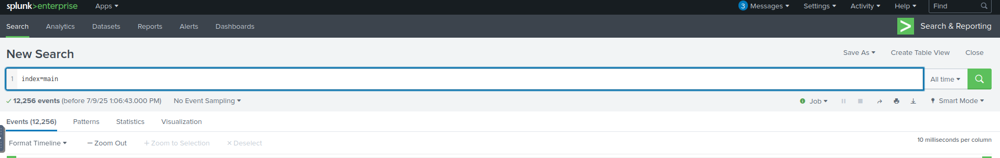

###### How many events were collected and Ingested in the index **main**? : `12256`

Next, we need to find the user that was created and on which host.
- Looking at the fields tab, we see that for all the events, there is only 1 host, therefore, we know where the user was created.

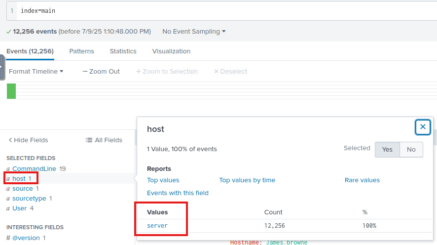

Now that we have the host, we need to look and see when and how a user was created.
- I thought to look through the `CommandLine` field to see if any command was done to add a new user. (not the best approach).

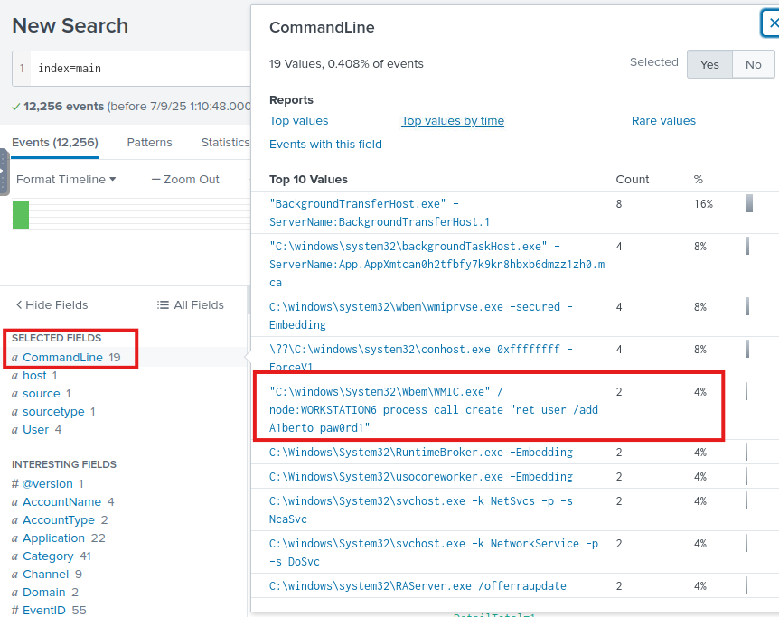

We see that a command was executed to add a user called `A1berto`.

The right way to do this was to first check the `SourceType`, which we see is only 1 in the fields tab, which is `eventlogs`.
- Therefore, the logs we have are searchable using windows event logs event IDs.

Searching online for the windows event log ID for user creation, [event ids](https://www.ultimatewindowssecurity.com/securitylog/encyclopedia/), we see that the user creation ID is `4720`.

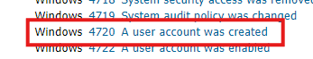

We can filter our search in Splunk using this value for the `EventID` field.

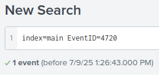

We see that 1 event is returned, Investigating that event, we see the following:

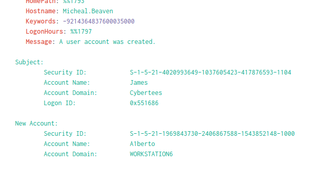

###### On one of the infected hosts, the adversary was successful in creating a backdoor user. What is the new username? : `A1berto`

To tackle the next point, I started to search for Windows Event Log Event IDs for registry modifications but to no avail.
- However, there is a Sysmon EventID for registry modifications, which is 13.

Searching for that ID, we see 1143 events. Not good.
- To narrow down our search, I added `A1berto` in the search, and voila, we get 1 hit.


###### On the same host a registry key was also updated regarding the new backdoor user. What is the full path of that registry key? : `HKLM\SAM\SAM\Domains\Account\Users\Names\A1berto`

To answer the next question, we need to find the user that is being impersonated.
- Taking a look at all the users present in the logs, by inspecting the `User` field in the fields tab on the left. 
- I found both `A1berto` and `Alberto`, where the first is the one the attacker is creating.
- Hence, the second user with the correct spelling is the one being impersonated.

###### Examine the logs and identify the user that the adversary was trying to impersonate : `Alberto`

Next, I ran a query to display all the `CommandLine` field values to try and look for the command that is used to add a backdoor user from another computer.

```
index="main" 
| stats count by CommandLine
```

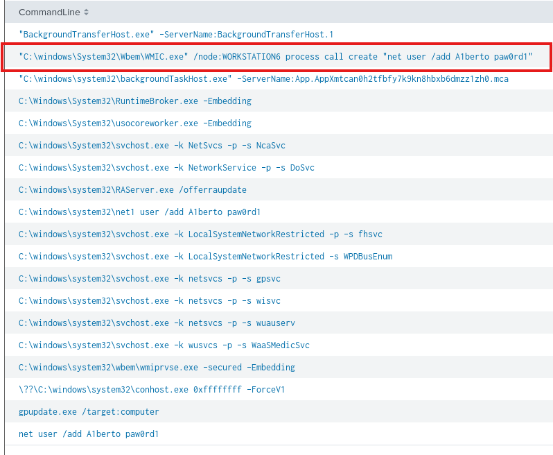

We see that the command uses `WMIC.exe`, which is the Windows Management Instrumentation Command-Line tool, an administrative tool.
- It specifies the remote computer `WORKSTATION6` to execute the command on, and the command being executed is to add a user local to that machine.
- The indicator of attack here is that `WMIC` is being executed from one host and targeting another, and that there is a `ner user` command being run remotely.

###### What is the command used to add a backdoor user from a remote computer? : `C:\windows\System32\Wbem\WMIC.exe" /node:WORKSTATION6 process call create "net user /add A1berto paw0rd1`

This next question pissed me off, as I spent some time trying to search for logins but I couldn't find anything..
- So I entered the answer as `0`, and it works...

I know that the successful logon EventID is `4624`, so I search for that EventID and add in the query `A1berto`, and I get no hits.

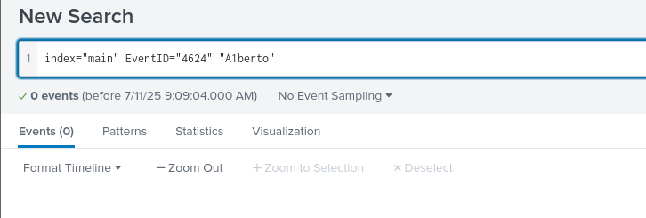

I try to set the `Category` field to `logon` and added `A1berto` and I still get no hits.

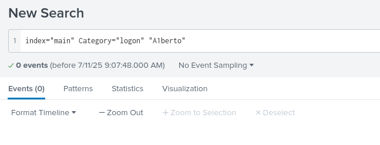

So I see there's another EventID `4648`, which attempts login using explicit credentials, but still to no avail.

###### How many times was the login attempt from the backdoor user observed during the investigation? : `0`

To solve the next question, we need to find all the commands that were run in `powershell`, and group them by their `Hostname`.
```
index="main" powershell
| stats count by CommandLine, Hostname
```

This query returns only 1 result, and this is the command that was used to add the backdoor user.

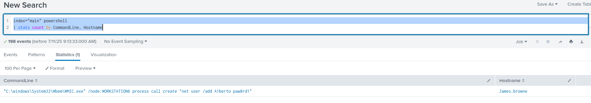

We see that the hostname here is `James.browne`

###### What is the name of the infected host on which suspicious Powershell commands were executed? : `James.browne`

Going for a quick google search on PowerShell event logging, we see that there are these EventIDs:
- `4103`: PowerShell module logging
- `4014`: PowerShell script logging

Modifying the query to look for these EventIDs:
```
index=main EventID=4104 OR EventID=4103
| stats count by EventID
```

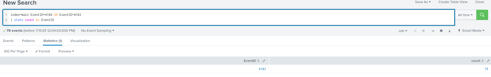

We see that only the EventID `4103` returned 79 events.

###### PowerShell logging is enabled on this device. How many events were logged for the malicious PowerShell execution? : `79`

The next question says that an encoded PowerShell script initiated a web request.
- First, we need to find this encoded PowerShell script.

Observing the fields tab on the left shows that there is a `ContextInfo` field, and this field has the PowerShell script execution context.

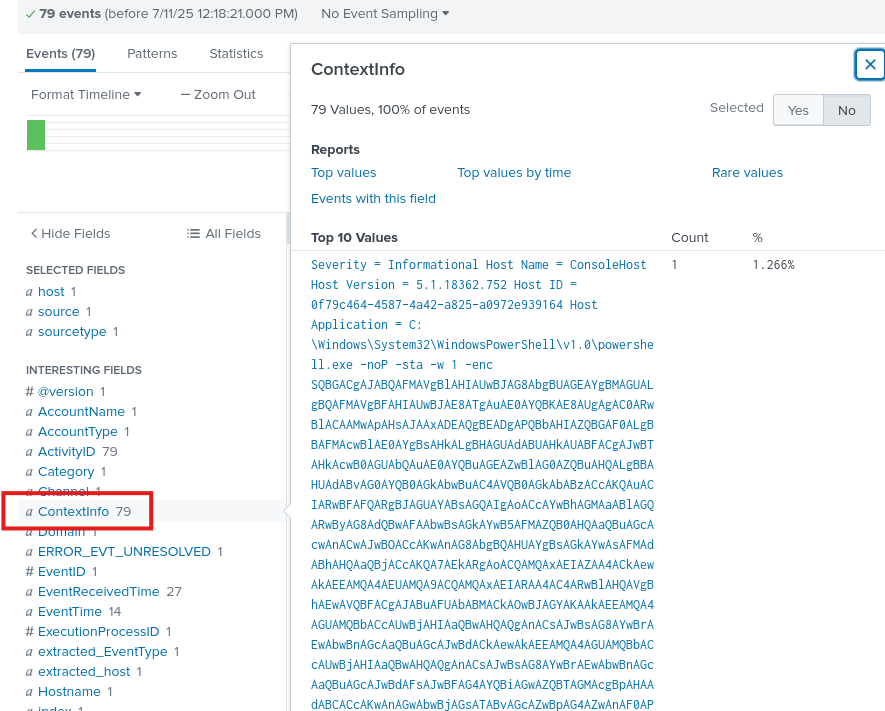

We see in the context there is a long encoded script, and if we keep scrolling to the end we see `==`, which indicates this is `base64` encoding.

Taking this entire encoded block and putting it in a file, then running the command:
```bash
echo script.txt | base64 -d
```

We get the following output:

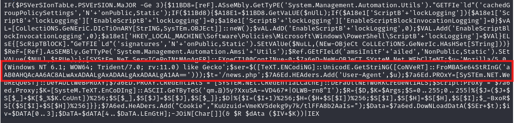

Skimming through we see that there is another encoding being done using `base64`, and then there is after it the `/news.php` path.
- I decode the value of the `FroMBASe64StRInG()`:

```bash
└─$ echo "aAB0AHQAcAA6AC8ALwAxADAALgAxADAALgAxADAALgA1AA==" | base64 -d 
http://10.10.10.5  
```

We get the IP address.
- Appending to it `/news.php` and we get the full URL: `http://10.10.10.5/news.php`

However, the hint states that we should defang this address, so using [CyberChef](https://toolbox.itsec.tamu.edu/#recipe=Defang_URL(true,true,true,'Valid%20domains%20and%20full%20URLs')&input=aHR0cDovLzEwLjEwLjEwLjUvbmV3cy5waHA), we get the output:
```
hxxp[://]10[.]10[.]10[.]5/news[.]php
```

###### An encoded Powershell script from the infected host initiated a web request. What is the full URL? : `hxxp[://]10[.]10[.]10[.]5/news[.]php`

---
