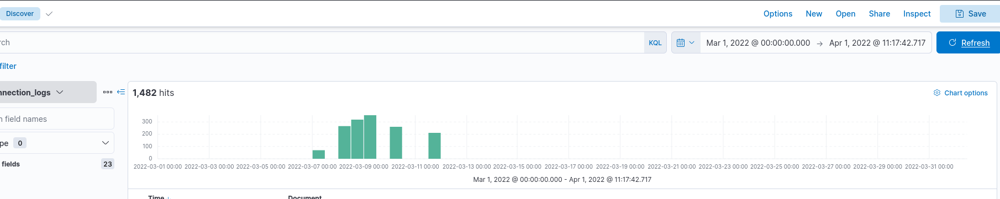
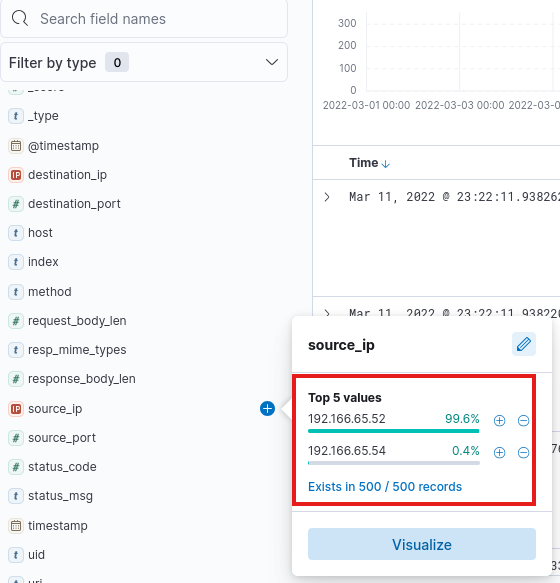
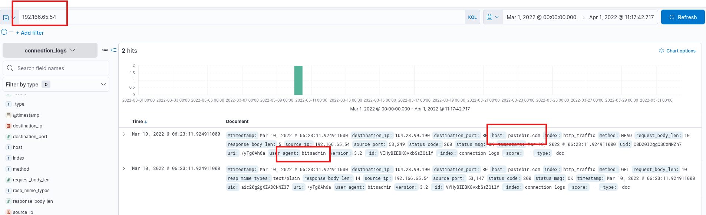
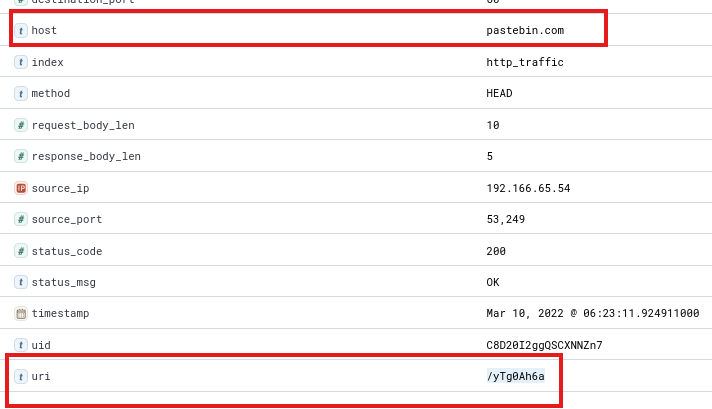
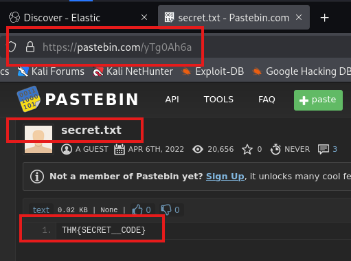

Opening the link and heading to the discover tab, we set the time to be the entire month of March 2022, and we see that there are 1482 events returned.

###### How many events were returned for the month of March 2022? : `1482`

Since we filtered for the month of march, we can easily open the field `source_ip` in the fields tab on the left, and see all the IPs that were in use.

We see 2 IP addresses, I go to the one that barely exists, `192.166.65.54`, and I filter only for it.
1. It seems suspicious that is rarely exists.
2. I tried the first IP and it didn't work :)

Filtering only for it, we see very suspicious activity which is obvious in the picture below, so I submitted it and it works!
- Accessing `pastebin`, which is used for communication by C2 attacks.
- Using `bitsadmin`, which is used by attackers in C2 attacks.

###### What is the IP associated with the suspected user in the logs? : `192.166.65.54`

###### The user’s machine used a legit windows binary to download a file from the C2 server. What is the name of the binary? : `bitsadmin`

###### The infected machine connected with a famous filesharing site in this period, which also acts as a C2 server used by the malware authors to communicate. What is the name of the filesharing site? `pastebin.com`

Opening one of the 2 event logs, we see that the user communicated with `pastebin.com` and accessed the `/yTg0Ah6a` page.

###### What is the full URL of the C2 to which the infected host is connected? : `pastebin.com/yTg0Ah6a`

After a long search in the logs, no file was found, so I decided to go the link `pastebin.com/yTg0Ah6a` and see what's on there.

We struck gold.

###### A file was accessed on the filesharing site. What is the name of the file accessed? : `secret.txt`

###### The file contains a secret code with the format THM{} : `THM{SECRET__CODE}`

---
