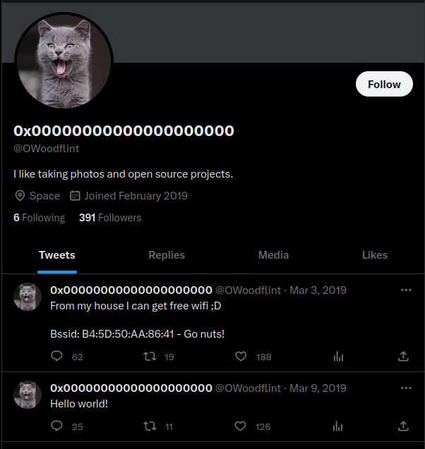
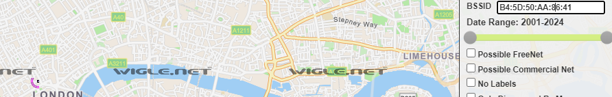
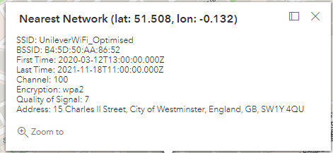
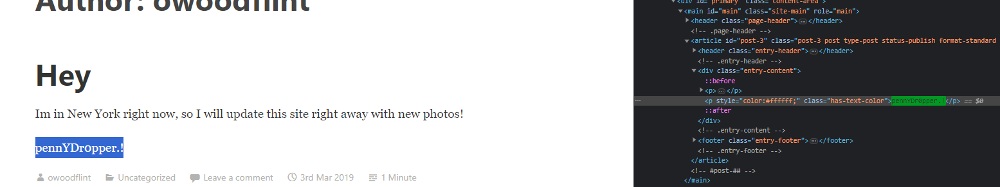

#OSINT #Internet #Dorks

---

> Downloading the image.


> Running the `exiftool` to get the metadata information of this image.

```shell
└─$ exiftool WindowsXP.jpg                   
ExifTool Version Number         : 12.63
File Name                       : WindowsXP.jpg
Directory                       : .
File Size                       : 234 kB
File Modification Date/Time     : 2023:08:04 13:11:11-04:00
File Access Date/Time           : 2023:08:04 13:12:23-04:00
File Inode Change Date/Time     : 2023:08:04 13:12:14-04:00
File Permissions                : -rw-r--r--
File Type                       : JPEG
File Type Extension             : jpg
MIME Type                       : image/jpeg
XMP Toolkit                     : Image::ExifTool 11.27
GPS Latitude                    : 54 deg 17' 41.27" N
GPS Longitude                   : 2 deg 15' 1.33" W
Copyright                       : OWoodflint
Image Width                     : 1920
Image Height                    : 1080
Encoding Process                : Baseline DCT, Huffman coding
Bits Per Sample                 : 8
Color Components                : 3
Y Cb Cr Sub Sampling            : YCbCr4:2:0 (2 2)
Image Size                      : 1920x1080
Megapixels                      : 2.1
GPS Latitude Ref                : North
GPS Longitude Ref               : West
GPS Position                    : 54 deg 17' 41.27" N, 2 deg 15' 1.33" W
```

> We see there is a name `OWoodflint`.
> Searching that up we see a twitter account.
> We also see a GitHub page.
> We also see a blog page.




###### What is this user's avatar of? : `cat`.

> Next, we see there are GPS coordinates from the `exiftool` output at the top.
> Trying those in a GPS coordinate locator isn't getting anything meaningful.
> We see there is the `Bssid: B4:5D:50:AA:86:41` tweet.

> Searching up what `BSSID` is, it is basically the MAC address of the wireless router that connects to the internet.
> There is a website that takes such addresses and converts it to geographic location, [wigle.net](https://wigle.net).



> We see the purple circle with the dot in london.

###### What city is this person in? : `London` .

> Pressing on the purple dot, we see this information.


> We see the SSID is `UnileverWiFi`.

###### What is the SSID of the WAP he connected to? : `UnileverWiFi` .

> From the GitHub we saw above, there is an email address in the `README.md` file.

```
OWoodflint@gmail.com
```

###### What is his personal email address? : `OWoodflint@gmail.com` .

###### What site did you find his email address on? : `GitHub` .

> From above, we see there is a blog page, in it information about `New York`.

###### Where has he gone on holiday : `New York` .

> Inspecting the source code, we see the password.



```
pennYDr0pper.!
```

###### What is the person's password? : `pennYDr0pper.!` .

---
